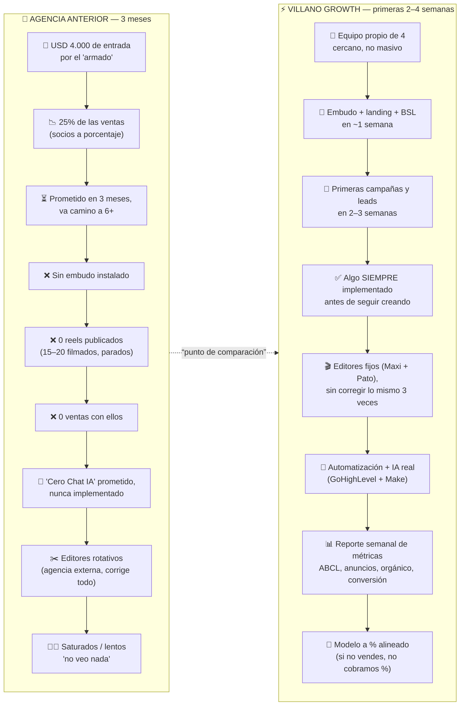
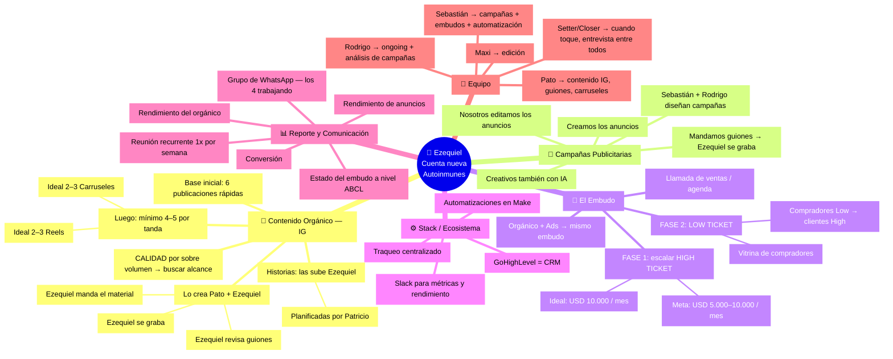
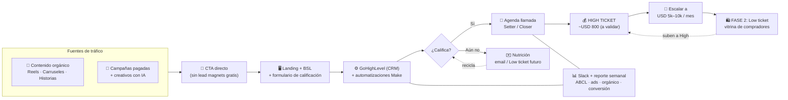
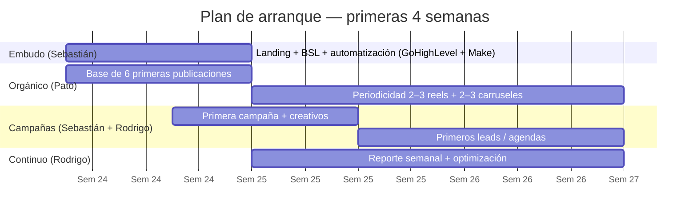

# Mapa Mental — Propuesta para Ezequiel

> **Proyecto:** Nueva cuenta de Instagram nichada en **enfermedades autoinmunes**
> (psoriasis, vitíligo, colitis ulcerosa, Crohn) con enfoque de **medicina funcional**.
> **Equipo Villano Growth:** Sebastián (campañas + embudos + automatizaciones) · Pato/Patricio (contenido IG) · Rodrigo (ongoing + análisis) · Maxi (edición).
> **Fecha:** Junio 2026 · **Para:** reunión con Ezequiel (jueves/viernes).

Este documento es el **mapa mental visual** que le mostramos a Ezequiel. Tiene 3 piezas:

1. **Dónde está hoy** → comparativa "Agencia anterior vs Nosotros".
2. **Qué construiríamos** → el ecosistema completo (mapa mental).
3. **Cómo se conecta todo** → el embudo y los plazos.

> 💡 Los diagramas están en **Mermaid**. Se ven solos en GitHub y en cualquier editor con
> vista previa Mermaid. Para presentar en pantalla, pega cada bloque en
> [mermaid.live](https://mermaid.live) y exporta a imagen.
>
> **Imágenes ya generadas** (listas para mostrar / pegar en una slide):
> `comparativa-agencia.png` · `mapa-mental-propuesta.png` · `flujo-embudo.png` · `plazos-gantt.png`
>
> **Para regenerarlas tras editar este archivo:**
> ```bash
> printf '{"args":["--no-sandbox"]}' > /tmp/pptr.json
> npx -y @mermaid-js/mermaid-cli -p /tmp/pptr.json -i Mapa-Mental-Propuesta.md -o mapa.png
> ```

---

## 1) Dónde está hoy Ezequiel — Agencia anterior vs. Nosotros

El punto de partida honesto: lleva **3 meses** con la agencia anterior y **todavía no salió a la cancha**.
No es para atacar a nadie — es para que tenga un **punto de comparación** claro.



| Tema | Agencia anterior | Villano Growth |
|---|---|---|
| **Tiempo de armado** | 3 meses prometidos → 6+ reales | Embudo en **~1 semana**, todo en **máx. 1 mes** |
| **Embudo de ventas** | No instalado | Llamada/agenda **funcionando** en 2–3 semanas |
| **Contenido publicado** | 0 reels en 3 meses | Base de **6 publicaciones** de inmediato |
| **Ventas** | 0 | Objetivo: **primeros leads en 2–3 semanas** |
| **Edición** | Editores rotativos externos | **Maxi + Pato fijos** |
| **Automatización / IA** | "Cero Chat IA" sin implementar | **GoHighLevel + Make** reales |
| **Visibilidad** | "No veo nada" | **Reporte semanal + Slack + WhatsApp** |
| **Filosofía** | Volumen de clientes, saturados | **Calidad > cantidad**, equipo cercano |

---

## 2) Qué construiríamos — el ecosistema completo



---

## 3) Cómo se conecta todo — el flujo del embudo



---

## 4) Plazos (lo que diferencia la velocidad)



| Hito | Plazo | Responsable |
|---|---|---|
| Landing + BSL + automatización montadas | **~1 semana** | Sebastián |
| Cuenta IG con 6 publicaciones base | **~1 semana** | Pato |
| Primera campaña al aire | **2 semanas** | Sebastián + Rodrigo |
| Primeros leads / agendas | **2–3 semanas** | Equipo |
| Todo el sistema operativo | **máx. 1 mes** | Equipo |

---

## 5) Modelo de trabajo y notas para la propuesta formal

- **Modelo de cobro:** porcentual según ticket y facturación actual (similar a la otra agencia,
  pero con **entrega comprobable** primero). → *Confirmar números finales con Rodrigo y Pato.*
- **Ticket nuevo programa:** ~**USD 800** (a validar mercado; los autoinmunes son menos pero
  con **altísima intención de compra** vs. diabetes/hipertensión, que son muchos pero "ruidosos").
- **Sociedad de Ezequiel:** él es la cabeza + un **médico especialista en autoinmunes** (aval del título).
- **Posible 2ª cuenta:** "Una Vida Sin Medicamentos" (diabetes/hipertensión, ~8–9k seguidores, hoy parada)
  → se puede reactivar más adelante con el mismo sistema.
- **Garantía implícita:** "si te entrego una planificación, la respeto". Velocidad + cercanía es el diferencial.

### Pendientes antes de presentar (action items de la reunión)
- [ ] Consultar a **Rodrigo y Pato** el caso de Ezequiel.
- [ ] Cerrar **scope, plazos y pricing** de la propuesta formal.
- [ ] Llamar a Ezequiel para coordinar el follow-up (jueves/viernes) y mostrar este mapa.
